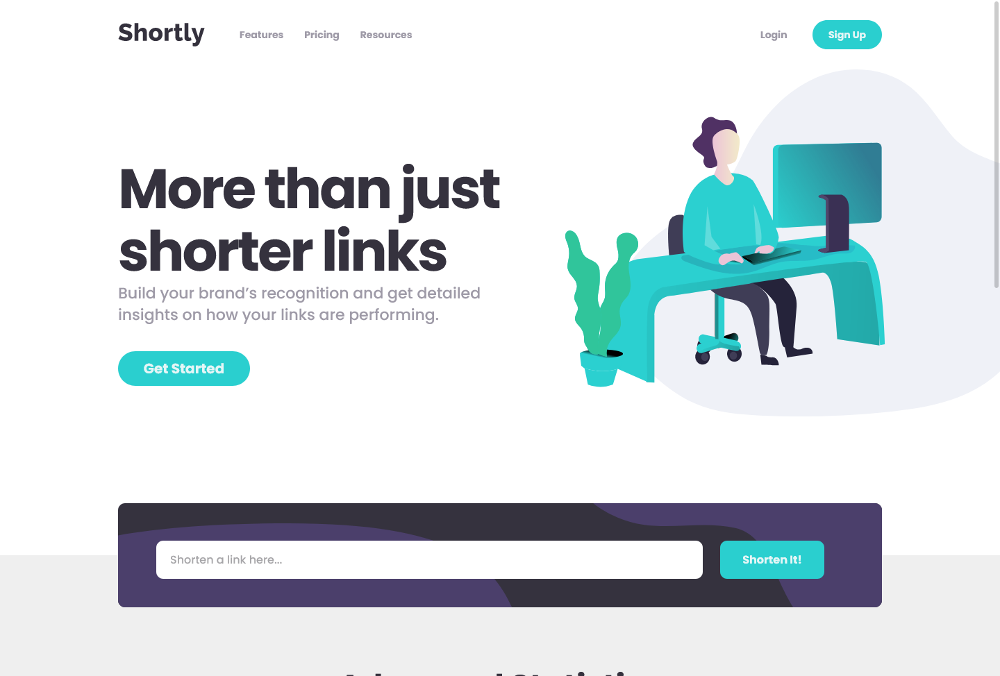
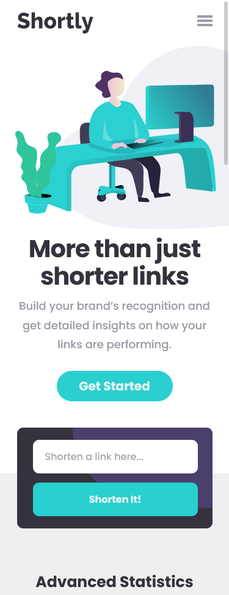

# Frontend Mentor - Shortly URL shortening API Challenge solution

This is a solution to the [Shortly URL shortening API Challenge challenge on Frontend Mentor](https://www.frontendmentor.io/challenges/url-shortening-api-landing-page-2ce3ob-G). Frontend Mentor challenges help you improve your coding skills by building realistic projects. 

## Table of contents

- [Overview](#overview)
  - [The challenge](#the-challenge)
  - [Screenshot](#screenshot)
  - [Links](#links)
- [My process](#my-process)
  - [Built with](#built-with)
  - [What I learned](#what-i-learned)
- [Author](#author)

## Overview

### The challenge

Users should be able to:

- View the optimal layout for the site depending on their device's screen size
- Shorten any valid URL
- See a list of their shortened links, even after refreshing the browser
- Copy the shortened link to their clipboard in a single click
- Receive an error message when the `form` is submitted if:
  - The `input` field is empty

### Screenshot

### Links

- Solution URL: [GitHub](https://github.com/DamianErasmus/urlshorteningapi)
- Live Site URL: [Netlify Deploy](https://deshorterlinks.netlify.app)

## My process

### Built with

- Semantic HTML5 markup
- CSS custom properties
- Flexbox
- CSS Grid
- Javascript

### What I learned

I've recorded myself working through this project and I am editing and uploading the videos to YouTube.
Find it on https://www.youtube.com/watch?v=LqSwUmT2eNU&list=PLd9OrahYx5U3ZytZZf-lW3yUS6XCfsJyO&ab_channel=DamianErasmus%27Development

## Author

- Website - [Damian Erasmus](https://damianerasmus.com)
- Frontend Mentor - [@DamianErasmus](https://www.frontendmentor.io/profile/DamianErasmus)
- Twitter - [@DEs_Development](https://twitter.com/DEs_Development)

